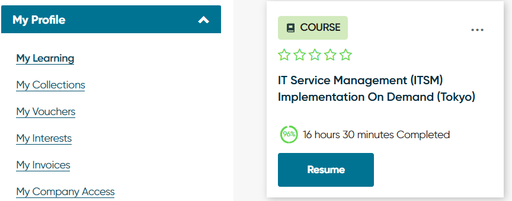
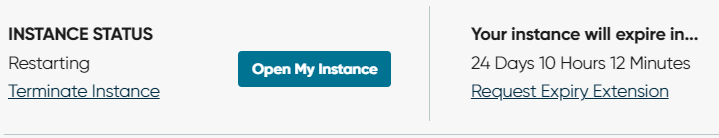

##### 

It's been 4 months since I left the company, so the instance ended. I need to request new instance for ITSM learning

Go to My Profile > My Learning and Resume the course.

I requested new instance. First, I was given 12 days. After I clicked 'Request Expiry Extension' several times, I could get some extra days. But it seems impossible to extend beyond 25 days.

It means that I have to finish my study til 25 days...

Whatever, I am unemployed now. 🤣 I can do that.

And my CSA certification is at risk to be expired. But I dunno how to fix it. So I sent a e-mail to servicenow... 🥺
